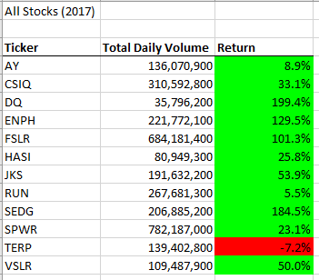
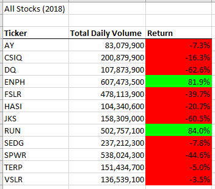
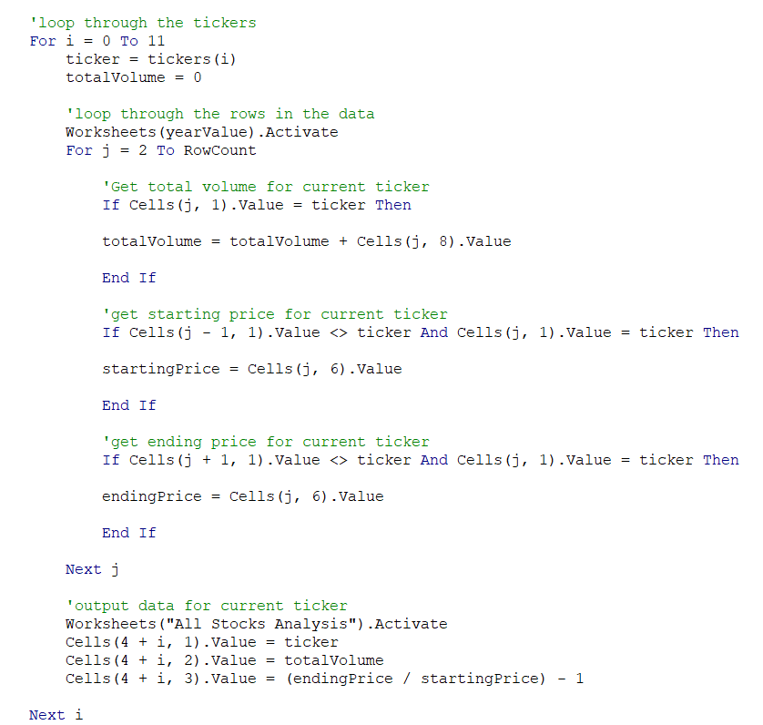
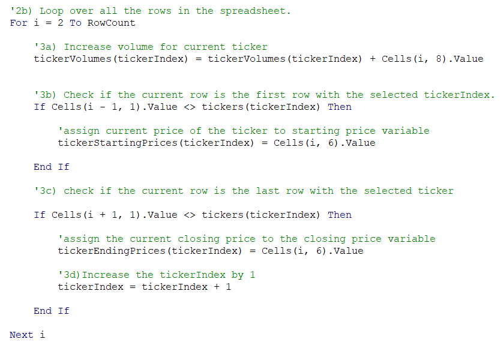
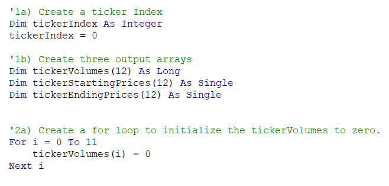
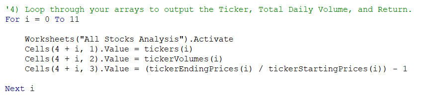
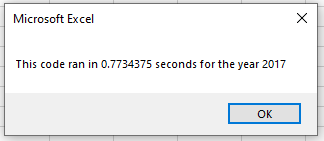
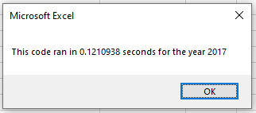
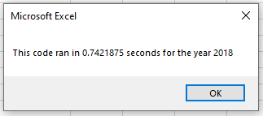

# An Analysis of Stocks Data 

## Overview 

Steve is a recent graduate with a finance degree. His parents are going to be his first clients. They are passionate about green energy and are interested in investing in green energy stocks. Steve's parents are particularly interested in investing in the DAQO stock however Steve wants to analyze multiple stocks to better advise his parents. Steve has created a excel file containing a dozen green energy stock data and needs help analyzing it. 

### Purpose

Steve wants to advise his parents on which green stocks to invest in. Hence, the purpose of the project is to analyze stock data to determine how the given stocks performed in the year 2017 and 2018. 

## Analysis

The [stocks data set](VBA_Challenge.xlsm) used in this analysis contains data on a dozen green energy stocks from the year 2017 to 2018. The data set was loaded in Excel and processed using VBA. The VBA code was refactored to automate analysis on multiple stocks if Steve wanted to analyze more stocks and do so efficiently. Additionally, buttons were added on the worksheets for easy access to running the analyses.   

## Results

### Stock Performance in 2017

In the above table, its clear that 2017 was overall a good year for the green energy stocks in this data set. DQ stocks was the highest performer with a 199.4% return, along with SEDG stocks following closely with a 184.5% return. Other two stocks that performed well were ENPH and FSLR, both with returns above 100%. 

The stocks with the lowest return this year were AY, RUN and TERP with 8.9%, 5.5% and -7.2% relatively. 

### Stock Performace in 2018

Overall, the green energy stocks in this data set performed poorly in the year of 2018. The two stocks that did well in 2018 are ENPH and RUN, with a return of 81.9% nd 84% relatively. These two were the only ones that had positive returns. 

SEDG stocks dropped to -7.8% return in the year 2018 in contrast to its 184% return in 2017. DQ dropped to -62.6% return which is a stark contrast to its performace in the year 2017. It was also the worst performing stock of the year 2018.

### Comparison of Execution Times of Original Script and Refactored Script

The code was refactored to improve efficiency and automate analyses to potentially use larger data sets by improving the logic of the code. 

Original | Refactored|
---------|-----------|
 | |

Nested loops generally make a code's performance inefficient and slow. The original code had a nested loop which was simplified in the refactored version using arrays. The if statements in the for loop were also simplified and used less lines of code. 

Arrays were used to store values for tickers, tickerVolumes, tickerStartingPrices and tickerEndingPrices. A variable, tickerIndex, was used to access the correct index across all four arrays. 

A for loop was used to output all the stored values at the end of the code. More comments were also added to make the code more readable and easy to understand. 

Original | Refactored
---------|-----------
 |  
 |

The refactored code significantly reduced the time required to execute the macros. The code executed roughly 0.65 seconds faster than the original code. 

## Summary

### Advantages of Refactoring the Code

Refactoring the code makes it cleaner, easy to maintain and more efficient to run. It also makes it easier to find errors by simplifying the code and improving the design of the code. It also allows the code to process more data and doing so efficiently. It furthur enhances automation of the code.   

### Disadvantages of Refactoring the Code

Refactoring the code maybe time consuming and does not improve the code's functionality. Refactoring may not be required if the code works and if it does not make the code significantly more efficient or faster. Since, it can be time consuming, refactoring the code may turn out to be expensive and may take away time from other activites important to the management.  

### Relating to the Original VBA Script
|       | Pros | Cons |
   |-------|------|------|
   | Original Code    |The pros of the original code was that the code worked. The original code also had several comments to describe the lines of code. |The cons of the original code was that it was inefficient and slow. It was also difficult to understand since a nested loop was used. It also took more lines of code. |
   | Refactored Code|As discussed in the Results section above, the refactored code was efficient and fast. It was easier to understand since it was simplified into smaller parts. Less lines of code were used. Many comments were used to explain the code. | The code was time consuming to refactor. An 2 - 3 hours of time went into refactoring the code which resulted in 0.65 seconds of gain in execution time of the code. Which may or may not be significant depending on the purpose of the code. Secondly, the refactoring resulted in the exact same output as the original code, not adding to the functionality of the code. 

In conclusion, whether or not a code requires refactoring needs to be evaluated. Although, refactoring might be a good idea most of the time, sometimes this time consuming task may turn out expensive.    

